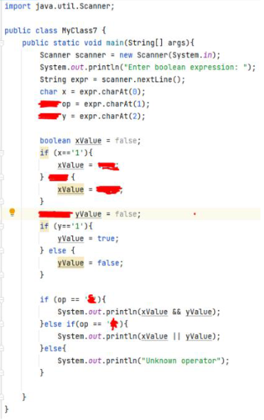
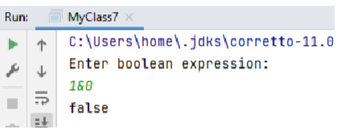

Урок 7. Логические операторы
Цель задания: Узнать о логических операторах, побольше исследовать тип
данных boolean, познакомится поближе с булевой алгеброй, таблицами истинности.
Задание:

<u>Задание 1. </u>Написать простой булев калькулятор.
Это задание не на знание программирования, а на понимание логики. Вы
можете как и сами написать код с нуля, так и заполнить недостающие данные на
рисунке 1.
Условия задания:
Пользователь, в одну строку, вводит первый операнд (1 или 0), оператор (& или
| ) и второй операнд (1 или 0), результат будет True, False или Неизвестный оператор. |
| ----------------------------------------------------------------------------------- |
                                                                         |

Результат

<u>Задание 2</u>. Решите логическую загадку. Советую решать ее без помощи интернета,
чтобы полностью осознать логику задачи.
Задача:
Альберт и Бернард только что познакомились с Шерил. Они хотят знать, когда у неё
день рождения. Шерил предложила им десять возможных дат: 15 мая, 16 мая, 19 мая,
17 июня, 18 июня, 14 июля, 16 июля, 14 августа, 15 августа и 17 августа. Затем Шерил
сказала Альберту месяц своего рождения, а Бернарду - день. После этого состоялся
диалог:
Альберт: Я не знаю, когда у Шерил день рождения, но я знаю, что Бернард тоже не
знает.
Бернард: Поначалу я не знал, когда у Шерил день рождения, но знаю теперь.
Альберт: Теперь я тоже знаю, когда у Шерил день рождения.
Когда у Шерил день рождения?